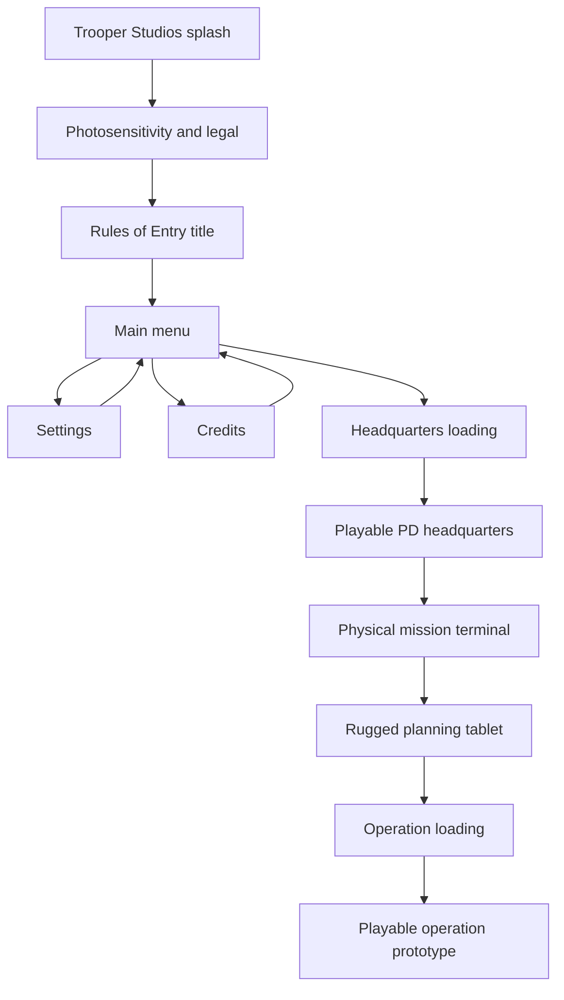

# System Map

## Front-end flow

## Responsibility map

| System | Owns | Does not own |
|---|---|---|
| `FrontEndFlowController` | splash/warning/title/menu state, settings, headquarters/training loading | mission selection, team assignment, or mission outcome |
| `HeadquartersMissionTerminalInteractable` | physical selection of an available operation | tablet presentation or deployment loading |
| `RuggedTabletController` | briefing navigation, officer/support/entry selections, ready-up, operation loading | AI behavior, officer careers, support-unit simulation, or scoring |
| `OperationBriefingDefinition` | operation intelligence, scene, entry plans, available personnel, support catalog | mutable scene state or UI layout |
| `OperationPlanningRules` | pure selection wrapping and deployability checks | Unity scene or input state |
| `OperationDeploymentContext` | stable cross-scene mission, entry, officer, and support identifiers | GameObjects, Transforms, ScriptableObject lifetimes, or score |
| `MissionDefinition` | objectives and operation identity evaluated by the mission system | headquarters presentation or scene transition timing |
| `FrontEndButtonVisual` | hover, selection, press, and focus response | input bindings or navigation policy |
| `FrontEndMenuItemVisual` | restrained focus, divider, and label motion for flat main-menu navigation | button actions or scene transitions |
| `FrontEndRules` | pure quality-index and loading-progress rules | Unity scene state |
| `RulesOfEntryUiPresentationSetup` | front-end generation, HUD restyle, build order, studio setting | runtime mission or AI decisions |
| `PrototypePresentationController` | F10 diagnostic visibility and hint | diagnostic content or evidence |
| Existing gameplay UI | live interaction, weapon, officer, mission, and actor information | front-end navigation |
| `RulesOfEntryUiPresentationValidator` | saved-scene, build-order, input-module, identity, and HUD checks | automatic repair |
| `TemporaryHumanoidPoseDriver` | presentation-only Humanoid pose response to actor/custody/condition state | AI decisions, custody transitions, damage, hit detection, or movement |
| `RulesOfEntryTemporaryCharacterSetup` | Humanoid import, neutral HDRP materials, reversible suspect visual installation | production character optimization or gameplay behavior |
| `RulesOfEntryTemporaryCharacterValidator` | model, actor-contract, material, collider, and performance-boundary checks | animation authoring or asset licensing |

## Presentation invariants

- The authored front end is the first enabled build scene.
- Headquarters is the second enabled build scene; the playable operation prototype is third.
- Campaign mission selection is a physical interaction inside headquarters.
- The rugged tablet may expose future support definitions, but unavailable systems cannot be selected or deployed.
- Ready-up requires a valid operation, entry plan, and at least one available officer.
- Cross-scene deployment state contains identifiers only.
- The front end contains exactly one complete flow controller and an Input System UI module.
- The warning cannot auto-advance and accepts only Enter, numpad Enter, or controller South/A.
- Campaign save placeholders remain visibly disabled; Operations is the temporary prototype route into headquarters.
- Saved scene dependencies include the splash, warning, and tactical-menu sprites.
- Loading text identifies the actual headquarters or mission destination and selected entry context.
- No legacy UI input module is permitted.
- Existing functional HUD roots remain present in the prototype scene.
- Developer diagnostics are hidden by default but remain inspectable with F10.
- Build preprocessing fails if the saved front-end or prototype presentation contract is broken.
- The temporary FBX adds no colliders and cannot replace the prototype suspect's existing hit regions.
- The temporary pose driver reads authoritative state and never writes AI, condition, or custody state.
