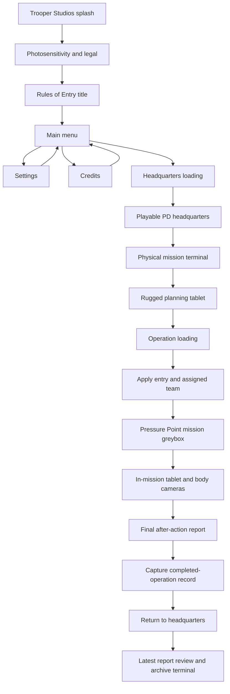

# System Map

## Milestone 7C operation closure and headquarters review

- `CompletedOperationRecord` — immutable final report plus stable operation, entry, officer, and support identifiers; owns no scene references.
- `CompletedOperationContext` — latest-completed-operation application-session boundary; deliberately not a disk save or campaign history.
- `MissionAfterActionPresentation` — final report presentation and Continue control; captures the completed record, consumes deployment context, and asynchronously returns to headquarters.
- `HeadquartersAfterActionReviewController` — renders the stored final report without recalculating it and owns review-time cursor/gameplay transfer.
- `HeadquartersAfterActionTerminalInteractable` — physical headquarters entry point for reopening the latest session report.
- `RulesOfEntryMilestoneSevenCSetup` / `Validator` — rebuilds report/HQ presentation, installs Input System UI support, and validates both saved scenes and the scene-free boundary.

## Milestone 7B completion and after-action evaluation

- `MissionCompletionRules` — pure gate requiring all required objectives to be terminal and every captured tactical room to be verified clear.
- `MissionController` — observes the gate, holds a stable confirmation window, captures one final snapshot, and changes phase to After Action.
- `ActorEvidenceSnapshot` — immutable actor, condition, custody, behavior, original/accessible/secured weapon, search, and reportable-item facts.
- `AfterActionEvaluator` — deterministic 100-point evaluator for objectives, civilians, suspects, officers, ROE, evidence, and time.
- `MissionScoreCategory` — immutable earned/maximum/category explanation used by UI and future persistence.
- `MissionOutcomeMetrics` — factual civilian, suspect, officer, and evidence totals attached to the report.
- `AfterActionReport` — immutable final score, S-through-F tier, operational rating, score cap, categories, metrics, objectives, and ROE findings.
- `MissionAfterActionPresentation` — read-only full-screen final report; disables gameplay input only after final evidence lock.
- `RulesOfEntryMilestoneSevenBSetup` / `Validator` — configures timing/auto-completion, installs the presentation, and validates the saved contract.

## Milestone 7A mission topology and scenario authoring

- `OperationRoomNode` — stable operational-area identity and optional authoritative clearance-volume binding.
- `OperationPortal` — explicit two-area connection; identifies open passages versus physical interior/exterior doors and exposes actual traversal state.
- `OperationTopology` — maps planning entry IDs to staging areas and exposes validated room routes without controlling AI.
- `OperationTopologyRules` — pure graph validation, breadth-first routing, and deterministic weighted spawn selection.
- `OperationSpawnPoint` — role-compatible authored pose, room membership, and selection weight.
- `OperationScenarioDirector` — places existing incident actors before mission evaluation, logs the applied seed, and preserves stable actor identities.
- `RulesOfEntryMilestoneSevenASetup` — builds the pumping-annex greybox, reauthors deployment anchors, updates the room objective, persists NavMesh data, and installs topology/scenario references.
- `RulesOfEntryMilestoneSevenAValidator` — validates packages, graph connectivity, room evidence, doors/links, scenario variation, deployment formations, NavMesh data, and architecture boundaries.

## Milestone 6C deployment and operation tablet

- `OperationEntryAnchor` — authored stable-ID player and officer spawn contract inside an operation scene.
- `OperationDeploymentCoordinator` — applies identifier-only headquarters selection to scene-owned player, NavMesh agents, and squad roster.
- `OfficerBodyCameraSource` — owns a disabled-by-default physical camera viewpoint and grants one selected live stream target at a time.
- `InMissionTabletController` — separate operational tablet; presents situation, objectives, and selected deployed-officer camera without mutating gameplay evidence.
- `OperationTabletRules` — pure feed-index wrapping and explicit signal presentation rules.
- `RulesOfEntryMilestoneSixCSetup` — configures officer camera prefabs, creates the operational tablet prefab, authors entry anchors, and installs scene references.
- `RulesOfEntryMilestoneSixCValidator` — validates camera defaults, tablet structure, stable entry mappings, deployed squad feeds, and the identifier-only boundary.

## Milestone 6B tactical HUD

- `TacticalHudController` — operation HUD coordinator; refreshes squad rows, body-camera metadata, command visibility, and command focus.
- `TacticalHudOfficerRow` — reusable presentation row for any configured `TacticalOfficerController`.
- `BodyCameraIdentity` — campaign-facing player identity, department, recording, and battery boundary.
- `MissionClock` — authoritative operation timestamp source for the body-camera overlay.
- `OfficerAmmunitionStatus` — qualitative NPC ammunition feed; never exposes precise round counts to the HUD.
- `OfficerSquadController` — scalable team selection/order dispatch and authoritative command-target raycast.
- `OfficerCommandSlotRules` — tested mapping from MMB number slots `1–6` to established officer order types.
- `TacticalPlayerInput` — current Input System bridge; MMB holds the menu and number keys issue commands only while held.
- `RulesOfEntryTacticalHudSetup` — creates the HUD prefab, adds data components, updates input bindings, and installs the operation-scene instance.
- `RulesOfEntryTacticalHudValidator` — validates bindings, prefab feeds, HUD structure, and scene integration.

## Front-end flow

## Responsibility map

| System | Owns | Does not own |
|---|---|---|
| `FrontEndFlowController` | splash/warning/title/menu state, settings, headquarters/training loading | mission selection, team assignment, or mission outcome |
| `HeadquartersMissionTerminalInteractable` | physical selection of an available operation | tablet presentation or deployment loading |
| `RuggedTabletController` | briefing navigation, officer/support/entry selections, ready-up, operation loading | AI behavior, officer careers, support-unit simulation, or scoring |
| `OperationBriefingDefinition` | operation intelligence, scene, entry plans, available personnel, support catalog | mutable scene state or UI layout |
| `OperationPlanningRules` | pure selection wrapping and deployability checks | Unity scene or input state |
| `OperationDeploymentContext` | stable cross-scene mission, entry, officer, and support identifiers | GameObjects, Transforms, ScriptableObject lifetimes, or score |
| `OperationDeploymentCoordinator` | selected entry placement and scene-owned deployed roster | headquarters selections, mission scoring, or AI decisions |
| `OperationTopology` | stable areas, portals, entry bindings, and route queries | AI behavior, door movement, room-clear truth, or mission scoring |
| `OperationScenarioDirector` | seeded placement of existing suspect/civilian actors at compatible authored points | actor creation, AI decisions, objectives, custody, or evidence evaluation |
| `TacticalRoomVolume` | timed, revocable no-threat clearance truth for one bounded interior space | map routing, scenario selection, or score |
| `OfficerBodyCameraSource` | officer-mounted viewpoint and on-demand stream state | tablet navigation, commands, recording evidence, or hidden AI state |
| `InMissionTabletController` | read-only situation/objective/body-camera presentation and tablet control transfer | deployment planning, mission mutation, officer control, or pausing the operation |
| `MissionDefinition` | objectives and operation identity evaluated by the mission system | headquarters presentation or scene transition timing |
| `MissionCompletionRules` | required-objective and all-room readiness decision | custody, AI commands, room state mutation, or scoring |
| `AfterActionEvaluator` | deterministic categories, metrics, caps, score, tier, and rating from one evidence snapshot | combat, injury, custody, inventory, AI, or room mutation |
| `MissionAfterActionPresentation` | final report layout and post-lock gameplay-input suppression | evidence capture, score calculation, or campaign consequences |
| `CompletedOperationContext` | latest immutable final report and stable deployment identifiers across the return transition | Unity scene objects, report recalculation, disk persistence, or career progression |
| `HeadquartersAfterActionReviewController` | latest-report rendering and review-time input ownership | mission evaluation, report mutation, or multi-operation history |
| `HeadquartersAfterActionTerminalInteractable` | physical reopening of the current session's latest report | evidence ownership or campaign save data |
| `FrontEndButtonVisual` | hover, selection, press, and focus response | input bindings or navigation policy |
| `FrontEndMenuItemVisual` | restrained focus, divider, and label motion for flat main-menu navigation | button actions or scene transitions |
| `FrontEndRules` | pure quality-index and loading-progress rules | Unity scene state |
| `RulesOfEntryUiPresentationSetup` | front-end generation, HUD restyle, build order, studio setting | runtime mission or AI decisions |
| `PrototypePresentationController` | F10 diagnostic visibility and hint | diagnostic content or evidence |
| Existing gameplay UI | live interaction, weapon, officer, mission, and actor information | front-end navigation |
| `RulesOfEntryUiPresentationValidator` | saved-scene, build-order, input-module, identity, and HUD checks | automatic repair |
| `TemporaryHumanoidPoseDriver` | presentation-only Humanoid pose response to actor/custody/condition state | AI decisions, custody transitions, damage, hit detection, or movement |
| `RulesOfEntryTemporaryCharacterSetup` | Humanoid import, neutral HDRP materials, reversible suspect visual installation | production character optimization or gameplay behavior |
| `RulesOfEntryTemporaryCharacterValidator` | model, actor-contract, material, collider, and performance-boundary checks | animation authoring or asset licensing |

## Presentation invariants

- The authored front end is the first enabled build scene.
- Headquarters is the second enabled build scene; the playable operation prototype is third.
- Campaign mission selection is a physical interaction inside headquarters.
- The rugged tablet may expose future support definitions, but unavailable systems cannot be selected or deployed.
- Ready-up requires a valid operation, entry plan, and at least one available officer.
- Cross-scene deployment state contains identifiers only.
- Operational deployment resolves only through authored, unique scene entry anchors.
- Every Milestone 7A interior area has a unique stable room ID; the mission objective consumes that ID rather than scene names or object references.
- Every topology area is reachable from at least one authored entry, and planning entry IDs match topology bindings exactly.
- Door portals become navigable only when physical door clearance activates their fixed link; open passages never invent door state.
- Scenario variation repositions existing actors only; it cannot add threats, change roles, decide behavior, or mutate mission outcomes.
- Automatic completion requires every required objective to be terminal and every captured tactical room to be `Clear` with zero active threats for the confirmation window.
- Evidence opportunities affect the final score but never silently prevent automatic completion.
- A required-objective failure or officer death caps the tier at D; a civilian death or critical ROE violation caps it at F.
- Final report Continue captures the immutable result before consuming deployment state and loading headquarters.
- Headquarters review renders the captured result unchanged; it never reruns evaluation.
- The current archive is session-only and holds one latest report; persistence may not be inferred.
- The applied incident seed is logged so a placement can be reproduced during debugging.
- Unassigned officers are removed from the deployed squad before HUD and body-camera lists rebuild.
- Raising the in-mission tablet disables player gameplay input but never pauses AI or mission time.
- Only the selected officer camera may render; other officer cameras remain disabled with no target texture.
- The front end contains exactly one complete flow controller and an Input System UI module.
- The warning cannot auto-advance and accepts only Enter, numpad Enter, or controller South/A.
- Campaign save placeholders remain visibly disabled; Operations is the temporary prototype route into headquarters.
- Saved scene dependencies include the splash, warning, and tactical-menu sprites.
- Loading text identifies the actual headquarters or mission destination and selected entry context.
- No legacy UI input module is permitted.
- Existing functional HUD roots remain present in the prototype scene.
- Developer diagnostics are hidden by default but remain inspectable with F10.
- Build preprocessing fails if the saved front-end or prototype presentation contract is broken.
- The temporary FBX adds no colliders and cannot replace the prototype suspect's existing hit regions.
- The temporary pose driver reads authoritative state and never writes AI, condition, or custody state.
