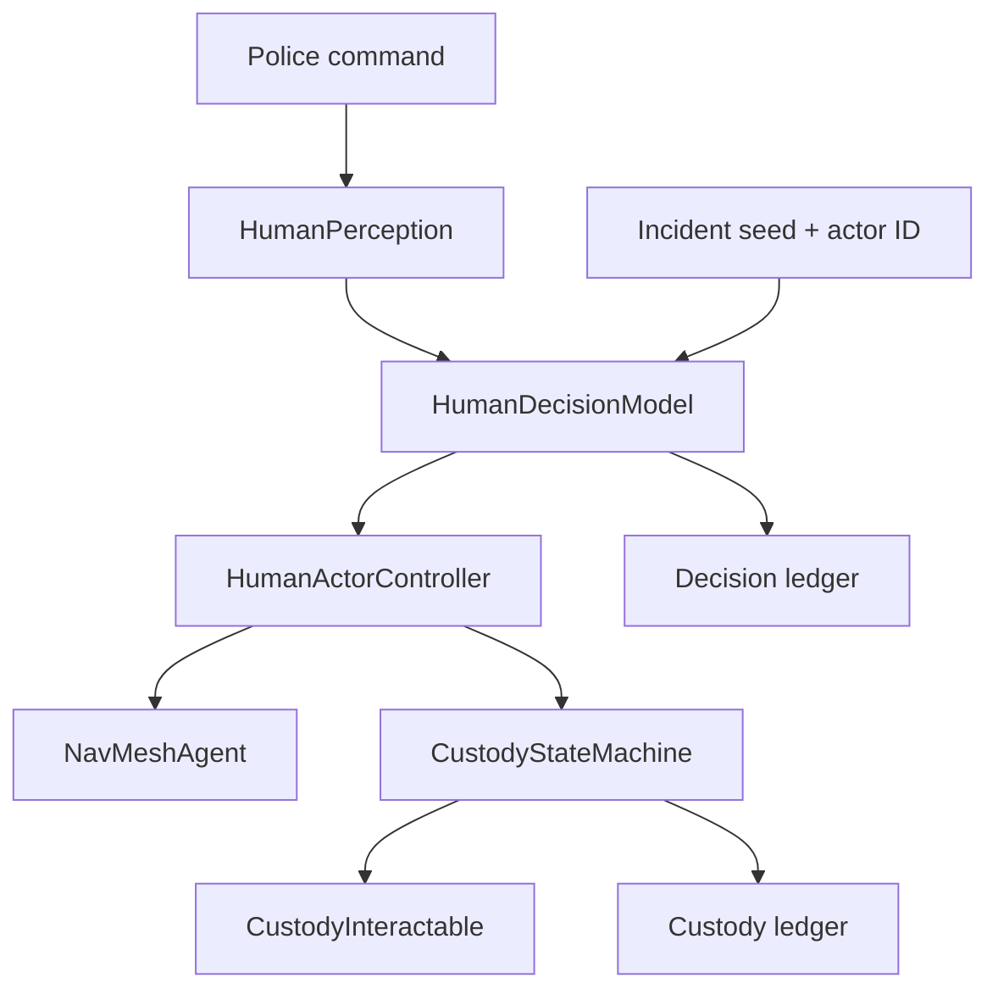
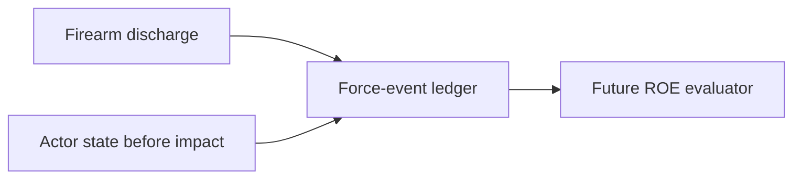

# System Map

## Milestone 3 authority flow

## Accountability bridge

The future evaluator is read-only. Milestone 3 does not assign penalties or points.

## Responsibility map

| System | Owns | Does not own |
|---|---|---|
| `ActorIdentity` | stable actor ID, name, role, incident seed | behavior or score |
| `ActorCondition` | blood volume, bleeding, consciousness, mobility, condition level | medical authenticity claims or HUD health |
| `HumanPerception` | sight/hearing tests and last known officer position | response choice |
| `HumanDecisionModel` | response score, response state, explicit reason, deception choice | movement or animation |
| `HumanActorController` | stress/morale updates, state application, movement intent | custody transition validity |
| `CustodyStateMachine` | valid procedural custody transitions | interaction timing or visuals |
| `CustodyInteractable` | player prompt and hold duration for the next valid step | authoritative custody history |
| `HumanDecisionLedger` | immutable ordered decision facts | ROE judgment |
| `CustodyEventLedger` | immutable ordered custody facts | mission result |
| `UseOfForceEventLedger` | discharge and pre-impact subject facts | justification or penalty |

## Generated assets

- `Data/AI/M3_UncertainSuspect.asset`
- `Data/AI/M3_PanickedCivilian.asset`
- `Data/AI/M3_PrototypeNavMesh.asset`
- `Prefabs/Actors/ROE_PrototypeSuspect.prefab`
- `Prefabs/Actors/ROE_PrototypeCivilian.prefab`
- `Prefabs/UI/ROE_HumanBehaviorDebugUI.prefab`
- `[Milestone3_HumanBehavior]` in `ROE_Prototype.unity`

## Invariants

- A free, capable subject cannot be instantly handcuffed or searched.
- Restraint requires surrender/secure positioning and controlled kneeling.
- Search requires restraints; custody confirmation requires search.
- Restrained subjects cannot abandon surrender.
- Every evaluated command has a recorded reason, score, and deterministic roll.
- Force records capture actor state before injury is applied.
- AI, combat, and custody code contain no direct mission-score mutation.
