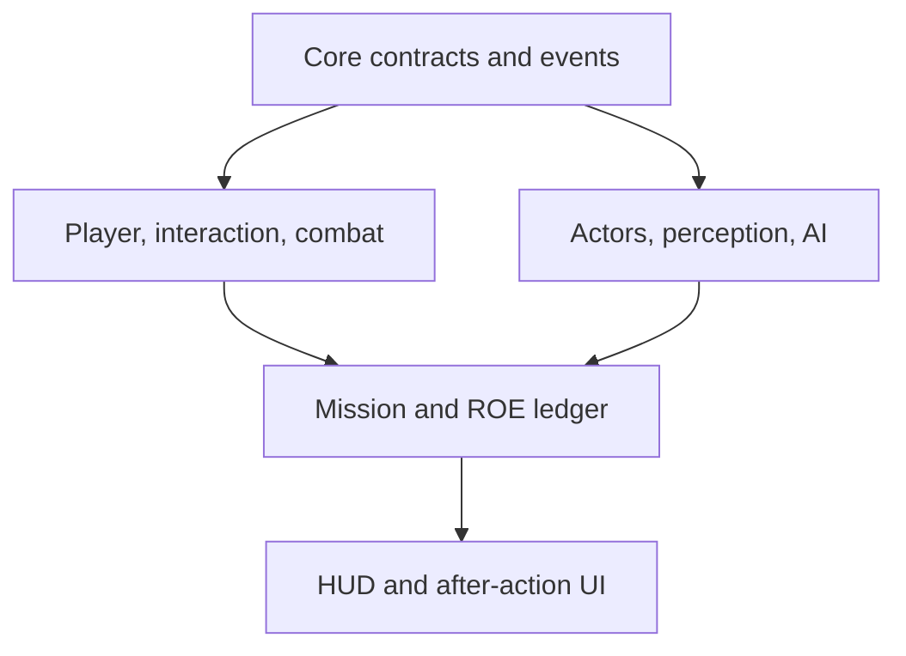

# System Map

## Proposed project-owned structure

```text
Assets/_Project/RulesOfEntry/
├── Art/
├── Audio/
├── Data/
│   ├── Actors/
│   ├── Equipment/
│   ├── Missions/
│   └── RulesOfEngagement/
├── Editor/
├── Input/
├── Prefabs/
│   ├── Actors/
│   ├── Environment/
│   ├── Interactions/
│   └── UI/
├── Runtime/
│   ├── Actors/
│   ├── AI/
│   ├── Combat/
│   ├── Commands/
│   ├── Core/
│   ├── Input/
│   ├── Interaction/
│   ├── Missions/
│   ├── Player/
│   ├── RulesOfEngagement/
│   ├── UI/
│   └── World/
├── Scenes/
│   ├── Bootstrap/
│   ├── Prototype/
│   └── Tests/
└── Tests/
    ├── EditMode/
    └── PlayMode/
```

Use a small initial assembly set: runtime, editor, Edit Mode tests, and Play Mode tests. Split runtime into additional assemblies only after dependencies are proven; premature fragmentation creates access-modifier and circular-reference failures.

## Runtime relationship



## System responsibilities

| System | Owns | Does not own |
|---|---|---|
| Core | IDs, clocks, common contracts, event types, diagnostics | gameplay decisions |
| Input | action references and player intent | movement physics or AI commands |
| Player | first-person locomotion, stance, camera | mission score |
| Interaction | focus, availability, timed interactions, prompts | target-specific state |
| Combat | weapon state, shot events, impacts, force events | whether force was justified |
| Actors | identity, condition, custody, shared capabilities | global mission flow |
| AI | perception, memory, decision state, navigation intent | player input or AAR rendering |
| Commands | officer selection, command orders, command execution state | AI perception |
| Missions | objectives, phase, spawn plan, incident seed | low-level actor movement |
| ROE | immutable event ledger and policy evaluation | weapon firing |
| UI | presentation and input-mode transitions | authoritative gameplay state |
| Editor | setup, generation, and validation | runtime dependencies |

## Actor model

Actors are composed from capabilities such as identity, condition, locomotion, perception, communication, inventory, compliance, custody, and role. Suspects, civilians, and officers use different brains and policies while sharing compatible capabilities.

Initial suspect states:

- unaware;
- suspicious;
- alert;
- hiding;
- fleeing;
- resisting;
- fighting;
- compliant;
- deceptive surrender;
- incapacitated;
- restrained/detained.

Initial civilian states:

- unaware;
- alarmed;
- panic;
- freeze;
- flee;
- hide;
- comply;
- secured.

## Accountability data flow

Every consequential action creates a timestamped event with actor, target, location, perceived threat context, action, equipment, and outcome. Mission objectives and ROE policy evaluate those events. The after-action report reads the resulting ledger, ensuring gameplay and scoring cannot disagree about what occurred.

## Naming conventions

- Root namespace: `RulesOfEntry`
- Runtime namespace pattern: `RulesOfEntry.<System>`
- Editor namespace: `RulesOfEntry.Editor`
- Test namespace: `RulesOfEntry.Tests`
- ScriptableObject definitions end in `Definition`.
- Runtime state types end in `State` only when they represent mutable state.
- Interfaces describe capability, such as `IInteractable`, `IDamageable`, or `ICommandReceiver`.
- Avoid generic manager names when a specific responsibility can be named.
