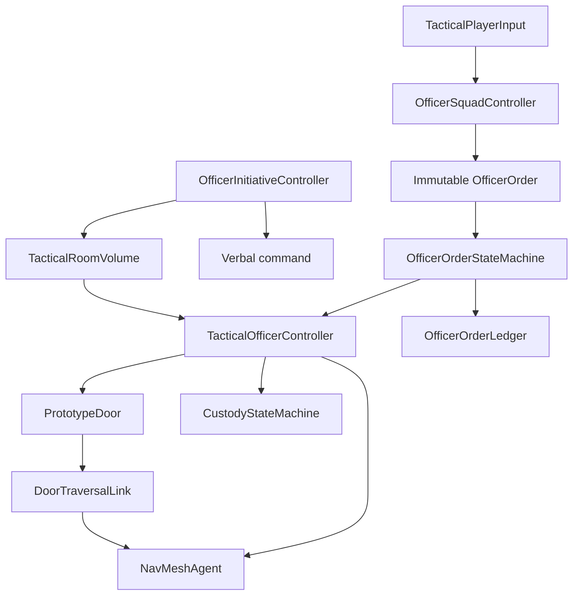

# System Map

## Milestone 4 command flow

## Responsibility map

| System | Owns | Does not own |
|---|---|---|
| `TacticalPlayerInput` | Input System action intent | target selection or execution |
| `OfficerSquadController` | selection, raycast context, immutable order creation, team spacing | officer navigation or custody validity |
| `OfficerOrder` | fixed command, issuer, receiver, target, sequence, time | mutable execution state |
| `OfficerOrderStateMachine` | legal lifecycle transitions and terminal outcome | scene objects, paths, animation, scoring |
| `TacticalOfficerController` | physical execution, path checks, timeout, door/custody task sequencing | command creation or mission score |
| `OfficerInitiativeController` | visible-suspect challenge, safe custody proposal, cover monitoring | direct custody transitions or room-clear truth |
| `TacticalRoomVolume` | bounded occupancy, active-threat count, two-officer/timed clearance authority | target perception, navigation, or handcuff execution |
| `RoomClearanceRules` | pure threat/control/custody eligibility policy | scene queries or mutable state |
| `OfficerInitiativeLedger` | append-only challenge and automatic-custody facts | behavior decisions or order execution |
| `DoorTraversalLink` | fixed doorway connection gated by physical door-leaf clearance | door animation, officer orders, teleportation |
| `OfficerOrderLedger` | append-only lifecycle facts | order decisions or after-action judgment |
| `OfficerOrderMarker` | temporary physical target feedback | authoritative order target |
| `OfficerCommandDebugUI` | prototype visibility into selection and outcomes | simulation authority |

## Generated assets

- `Prefabs/Actors/ROE_OfficerAlpha.prefab`
- `Prefabs/Actors/ROE_OfficerBravo.prefab`
- `Prefabs/UI/ROE_OfficerOrderMarker.prefab`
- `Prefabs/UI/ROE_OfficerCommandDebugUI.prefab`
- `Art/Materials/M4_OfficerUniform.mat`
- `Art/Materials/M4_OfficerArmor.mat`
- `Art/Materials/M4_OfficerAccent.mat`
- `Art/Materials/M4_OrderMarker.mat`
- `[Milestone4_OfficerTeam]` in `ROE_Prototype.unity`
- `M4_TrainingDoorTraversalLink` under the generated Milestone 4 scene root
- `M4_NorthTrainingRoomClearance` under the generated Milestone 4 scene root

## Invariants

- An order identifies exactly one receiving officer; a team command creates one immutable order per selected officer under one command sequence.
- A completed order must pass through accepted and executing.
- A terminal order cannot transition again.
- A newer command records the previous active order as superseded.
- A missing or incomplete physical path fails the order rather than moving the actor directly.
- A closed or insufficiently open door cannot provide a navigation path across its threshold.
- The doorway link remains fixed in world space and never follows the rotating door leaf.
- Follow remains interruptible and does not claim completion while active.
- A free, capable subject cannot be instantly restrained.
- Assisted restraint preserves surrender, kneeling, timed handcuff application, and verification.
- A visible free suspect can be challenged automatically, but remains free to comply, refuse, flee, threaten, or deceive.
- Room clearance requires two actionable officers and a continuous verified no-threat interval.
- Automatic custody requires a controlled or incapacitated suspect plus an actionable cover officer.
- Loss of clearance or cover terminates an initiative custody action with an explicit outcome.
- Civilians are never automatic custody targets.
- Officer code contains no mission scoring, auto-arrest, auto-reload, or navigation warp.
