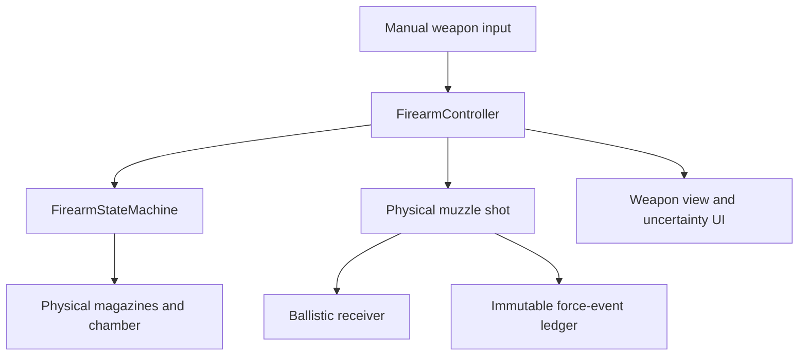

# System Map

## Milestone 2 authority flow

## Responsibility map

| System | Owns | Explicitly does not own |
|---|---|---|
| `FirearmStateMachine` | selector, chamber, bolt, inserted/spare/dropped magazines, live-round ejection | input, animation, score, ROE judgment |
| `FirearmController` | manual operation timing, input gating, physical muzzle shot, recoil request | automatic reload, ammo HUD, mission result |
| `WeaponStatusUI` | selector/posture feedback, temporary qualitative check result, operation progress | exact round state |
| `FirearmView` | graybox posture, reload/check/action poses, recoil motion | authoritative mechanics |
| `UseOfForceEventLedger` | immutable ordered discharge facts | justification or penalties |
| `PrototypeBallisticTarget` | prototype hit response | actor injury model |

## Data and generated assets

- `Data/Equipment/M2_PatrolCarbine.asset`
- `Data/Equipment/M2_556_62gr.asset`
- `Prefabs/Combat/ROE_BallisticTarget.prefab`
- `Prefabs/UI/ROE_WeaponStatusUI.prefab`
- nested `[Milestone2_WeaponRig]` in `ROE_Player.prefab`
- `[Milestone2_Range]` in `ROE_Prototype.unity`

## Key invariants

- Exact ammunition state exists for simulation, tests, and later accountability only.
- Player UI cannot reference `InsertedMagazineRounds` or `RoundCount`.
- No empty-state transition calls reload.
- A discharge removes one chambered round and produces one force event.
- A dry trigger produces no force event.
- Tactical reload retains the removed magazine at the back of pouch order.
- Emergency reload discards the removed magazine.
- Reloading an empty closed chamber still requires cycling the action.
