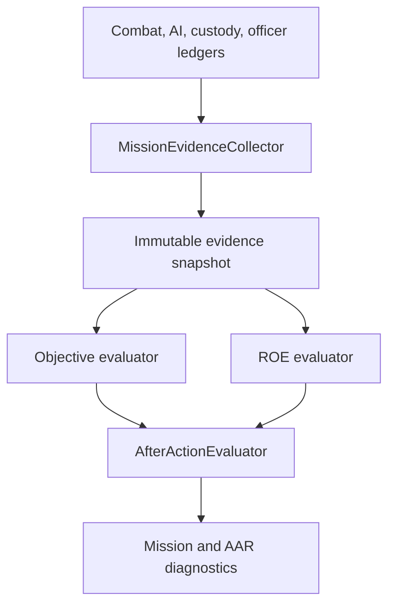

# System Map

## Milestone 5 evidence flow

## Responsibility map

| System | Owns | Does not own |
|---|---|---|
| `MissionDefinition` | briefing and objective configuration | live state or scoring side effects |
| `RulesOfEngagementPolicy` | finding deductions and critical score cap | threat perception or force events |
| `MissionEvidenceCollector` | read-only copying and chronological aggregation | mutation of any producer |
| `MissionObjectiveEvaluator` | deterministic objective status and rationale | mission phase or UI |
| `RulesOfEngagementEvaluator` | determination from pre-impact force facts | legal facts absent from evidence |
| `AfterActionEvaluator` | transparent score, caps, rating, and summary | gameplay changes |
| `MissionController` | mission phase, periodic snapshots, report finalization | combat, custody, or officer behavior |
| `MissionDebriefInteractable` | deliberate player request to end the active operation | objective credit or score mutation |
| `MissionAfterActionDebugUI` | prototype visibility | authoritative evidence or judgment |

## Invariants

- Evidence flows from simulation systems to mission evaluation only.
- Fact producers do not reference `RulesOfEntry.Missions`.
- A non-actor impact is not automatically judged lawful or unlawful.
- Force against civilians, officers, controlled people, or incapacitated people is a critical finding.
- A final report cannot rate a required-objective failure as `Acceptable` or `Exemplary`.
- Manual debrief converts pending objectives to failures before the final score is calculated.
- A critical ROE violation cannot score above the configured critical cap.
- Reports retain objective rationale and event-level ROE rationale.
