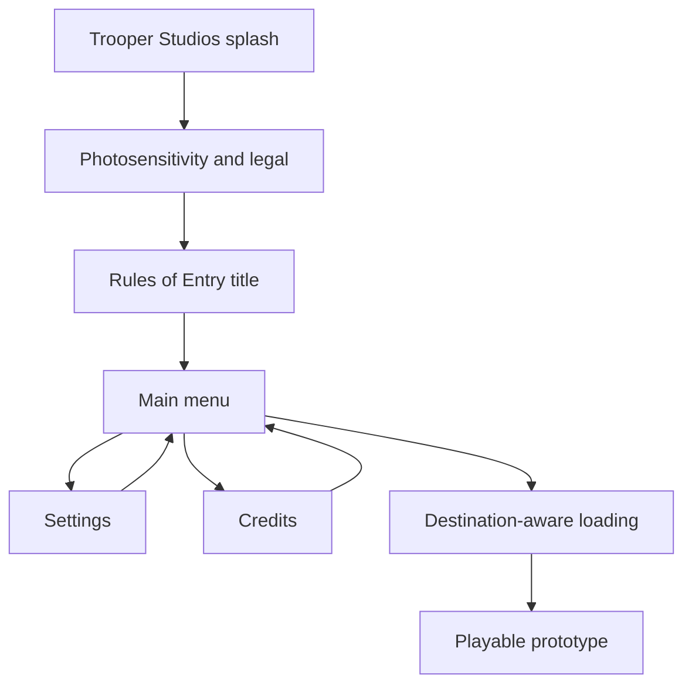

# System Map

## Front-end flow

## Responsibility map

| System | Owns | Does not own |
|---|---|---|
| `FrontEndFlowController` | splash/warning/title/menu state, transitions, settings, scene loading | gameplay simulation or mission outcome |
| `MissionDefinition` | authoritative operation display name shown by loading UI | scene transition timing or presentation layout |
| `FrontEndButtonVisual` | hover, selection, press, and focus response | input bindings or navigation policy |
| `FrontEndMenuItemVisual` | restrained focus, divider, and label motion for flat main-menu navigation | button actions or scene transitions |
| `FrontEndRules` | pure quality-index and loading-progress rules | Unity scene state |
| `RulesOfEntryUiPresentationSetup` | front-end generation, HUD restyle, build order, studio setting | runtime mission or AI decisions |
| `PrototypePresentationController` | F10 diagnostic visibility and hint | diagnostic content or evidence |
| Existing gameplay UI | live interaction, weapon, officer, mission, and actor information | front-end navigation |
| `RulesOfEntryUiPresentationValidator` | saved-scene, build-order, input-module, identity, and HUD checks | automatic repair |
| `TemporaryHumanoidPoseDriver` | presentation-only Humanoid pose response to actor/custody/condition state | AI decisions, custody transitions, damage, hit detection, or movement |
| `RulesOfEntryTemporaryCharacterSetup` | Humanoid import, neutral HDRP materials, reversible suspect visual installation | production character optimization or gameplay behavior |
| `RulesOfEntryTemporaryCharacterValidator` | model, actor-contract, material, collider, and performance-boundary checks | animation authoring or asset licensing |

## Presentation invariants

- The authored front end is the first enabled build scene.
- The playable prototype remains the second enabled build scene.
- The front end contains exactly one complete flow controller and an Input System UI module.
- The warning cannot auto-advance and accepts only Enter, numpad Enter, or controller South/A.
- Campaign placeholders remain visibly disabled; Operations is the first selectable main-menu item.
- Saved scene dependencies include the splash, warning, and tactical-menu sprites.
- The loading destination is saved as a reference to the Milestone 5 mission definition and may not be replaced with hard-coded generic text.
- No legacy UI input module is permitted.
- Existing functional HUD roots remain present in the prototype scene.
- Developer diagnostics are hidden by default but remain inspectable with F10.
- Build preprocessing fails if the saved front-end or prototype presentation contract is broken.
- The temporary FBX adds no colliders and cannot replace the prototype suspect's existing hit regions.
- The temporary pose driver reads authoritative state and never writes AI, condition, or custody state.
