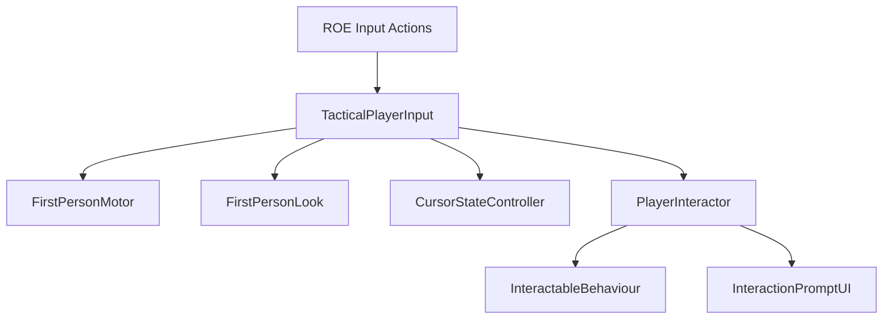

# System Map

## Milestone 1 flow

## Implemented files

| File | Responsibility |
|---|---|
| `Input/ROE_InputActions.inputactions` | Player and System actions for keyboard/mouse and gamepad |
| `Runtime/Input/TacticalPlayerInput.cs` | Resolves actions and exposes device-independent player intent |
| `Runtime/Player/FirstPersonMotor.cs` | CharacterController movement, gravity, sprint, crouch, and clearance check |
| `Runtime/Player/FirstPersonLook.cs` | Body yaw and clamped camera pitch |
| `Runtime/Player/CursorStateController.cs` | Cursor lock and gameplay action-map state |
| `Runtime/Interaction/InteractionContext.cs` | Actor/view/time data passed to targets |
| `Runtime/Interaction/InteractionPrompt.cs` | Immutable prompt availability and hold-duration data |
| `Runtime/Interaction/InteractableBehaviour.cs` | Base contract for target-specific interactions |
| `Runtime/Interaction/PlayerInteractor.cs` | Camera focus ray, instant use, and hold progress |
| `Runtime/Interaction/PrototypeDoor.cs` | Animated instant-interaction example |
| `Runtime/Interaction/PrototypeControlPanel.cs` | Stateful hold-interaction example |
| `Runtime/UI/InteractionPromptUI.cs` | Binding, action text, availability, and progress presentation |
| `Editor/Milestone1/RulesOfEntryMilestoneOneSetup.cs` | Creates layers, assets, prefabs, and graybox scene content |
| `Editor/Milestone1/RulesOfEntryMilestoneOneValidator.cs` | Validates the complete Milestone 0 and 1 contract |
| `Editor/Milestone1/RulesOfEntryMilestoneOneBuildValidator.cs` | Blocks builds containing Milestone 1 errors |
| `Tests/EditMode/MilestoneOneConfigurationTests.cs` | Enforces setup completeness |
| `Tests/PlayMode/MilestoneOneInteractionTests.cs` | Verifies door and control-panel state behavior |

## Generated assets

The Milestone 1 setup tool creates these assets inside the project:

- `Prefabs/Actors/ROE_Player.prefab`
- `Prefabs/Interactions/ROE_PrototypeDoor.prefab`
- `Prefabs/Interactions/ROE_PrototypeControlPanel.prefab`
- `Prefabs/UI/ROE_InteractionPromptUI.prefab`
- `Art/Materials/M1_Floor.mat`
- `Art/Materials/M1_Wall.mat`
- `Art/Materials/M1_Accent.mat`
- `Art/Materials/M1_Door.mat`

It updates `Scenes/Prototype/ROE_Prototype.unity` and adds `Player` and `Interactable` layers without choosing fixed layer numbers.

## Dependency boundaries

- Runtime code depends on `Unity.InputSystem` and `Unity.UGUI`, both already installed.
- Runtime code contains no `UnityEditor` dependency.
- Interaction targets own their state; the player interactor owns focus and input timing.
- UI observes interaction state and does not execute gameplay decisions.
- Movement and interactions do not mutate future mission score or ROE state.
