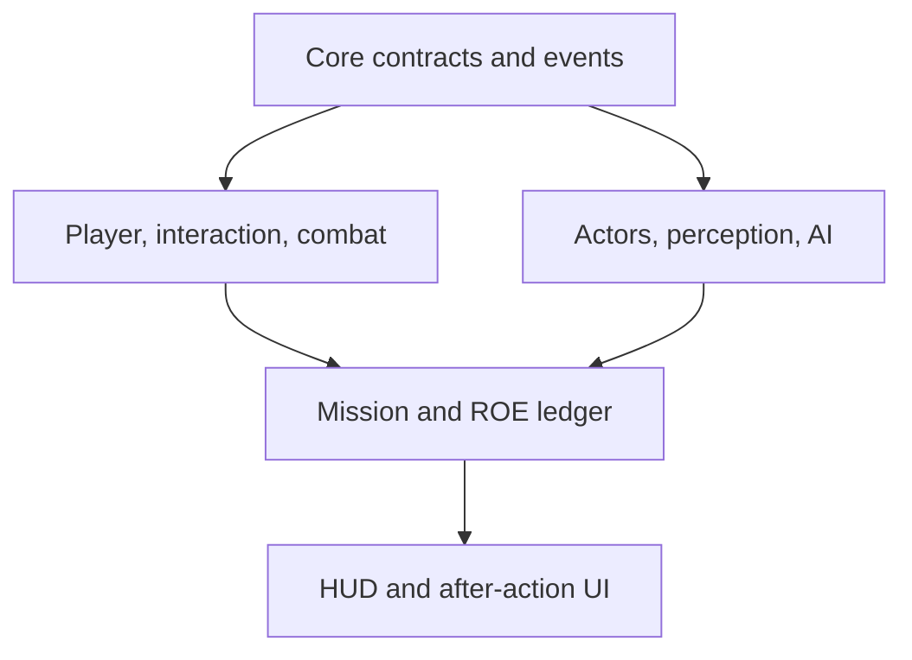

# System Map

## Project-owned structure

```text
Assets/_Project/RulesOfEntry/
├── Art/
├── Audio/
├── Data/
│   ├── Actors/
│   ├── Equipment/
│   ├── Missions/
│   └── RulesOfEngagement/
├── Editor/
│   └── Foundation/
├── Input/
├── Prefabs/
│   ├── Actors/
│   ├── Environment/
│   ├── Interactions/
│   └── UI/
├── Runtime/
│   ├── Actors/
│   ├── AI/
│   ├── Combat/
│   ├── Commands/
│   ├── Core/
│   ├── Input/
│   ├── Interaction/
│   ├── Missions/
│   ├── Player/
│   ├── RulesOfEngagement/
│   ├── UI/
│   └── World/
├── Scenes/
│   ├── Bootstrap/
│   ├── Prototype/
│   └── Tests/
└── Tests/
    ├── EditMode/
    └── PlayMode/
```

Milestone 0 uses four assemblies: runtime, editor, Edit Mode tests, and Play Mode tests. Runtime is intentionally kept unified until stable dependencies justify further splits.

## Implemented Milestone 0 files

| File | Responsibility |
|---|---|
| `Runtime/Core/ProjectInfo.cs` | stable identity, version, milestone, and authoritative asset paths |
| `Runtime/Core/ProjectLog.cs` | consistent project-owned logging |
| `Runtime/World/SceneFoundationMarker.cs` | identifies scene purpose and serialized schema |
| `Editor/Foundation/RulesOfEntryFoundationSetup.cs` | creates folders, prototype scene, marker, and Build Settings |
| `Editor/Foundation/RulesOfEntryProjectValidator.cs` | reports foundation drift and missing references |
| `Editor/Foundation/RulesOfEntryBuildValidator.cs` | blocks builds when validation errors exist |
| `Tests/EditMode/ProjectFoundationTests.cs` | validates identity and project configuration |
| `Tests/PlayMode/FoundationSmokeTests.cs` | validates runtime scene-marker behavior |

## Runtime relationship



## System responsibilities

| System | Owns | Does not own |
|---|---|---|
| Core | IDs, clocks, common contracts, event types, diagnostics | gameplay decisions |
| Input | action references and player intent | movement physics or AI commands |
| Player | first-person locomotion, stance, camera | mission score |
| Interaction | focus, availability, timed interactions, prompts | target-specific state |
| Combat | weapon state, shot events, impacts, force events | whether force was justified |
| Actors | identity, condition, custody, shared capabilities | global mission flow |
| AI | perception, memory, decision state, navigation intent | player input or AAR rendering |
| Commands | officer selection, command orders, command execution state | AI perception |
| Missions | objectives, phase, spawn plan, incident seed | low-level actor movement |
| ROE | immutable event ledger and policy evaluation | weapon firing |
| UI | presentation and input-mode transitions | authoritative gameplay state |
| Editor | setup, generation, and validation | runtime dependencies |

## Naming conventions

- Root namespace: `RulesOfEntry`
- Runtime namespace pattern: `RulesOfEntry.<System>`
- Editor namespace: `RulesOfEntry.Editor`
- Test namespace: `RulesOfEntry.Tests`
- ScriptableObject definitions end in `Definition`.
- Runtime state types end in `State` only when they represent mutable state.
- Interfaces describe capability, such as `IInteractable`, `IDamageable`, or `ICommandReceiver`.
- Avoid generic manager names when a specific responsibility can be named.
